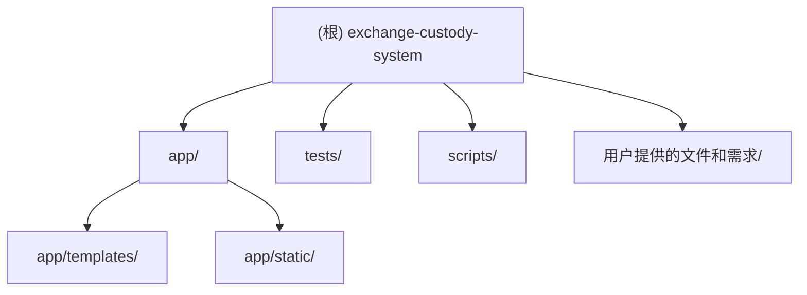

# 换汇资金托管系统 · 项目文档

> 变更记录见文末。

---

## 项目愿景

面向小型换汇/钱庄业务的轻量级资金流转追踪工具。支持多币种（AUD/USD/CNY/EUR）托管、现金与转账两类订单流程、中转商管理、账号余额实时计算，以及客户账单与公司账号流水报表。

---

## 架构总览

单体 Python Web 应用，采用 FastAPI + Jinja2 服务端渲染方案。数据持久化层使用 SQLite（可通过 `DATABASE_URL` 环境变量切换为其他数据库），ORM 层基于 SQLAlchemy 2.x。

```
浏览器（HTML 表单 + CSS）
        ↕ HTTP（GET/POST 表单提交）
FastAPI 路由层（app/main.py）
        ↕ 依赖注入（get_db）
业务逻辑层（app/services.py）
        ↕ SQLAlchemy ORM Session
SQLite 数据库（data/app.db）
```

无前端构建步骤，无 Node.js 依赖，纯服务端渲染。CSS 直接通过 `/static/style.css` 提供。

---

## 模块结构图



---

## 模块索引

| 模块路径 | 职责说明 |
|---|---|
| `app/` | 应用主体：路由、业务逻辑、数据模型、模板、样式 |
| `app/main.py` | FastAPI 应用实例与全部 HTTP 路由处理器 |
| `app/services.py` | 业务逻辑层：订单状态机、账本分录、汇率计算 |
| `app/models.py` | SQLAlchemy ORM 数据模型（8 张表） |
| `app/db.py` | 数据库引擎配置、Session 工厂、Schema 迁移警告检测 |
| `app/constants.py` | 业务常量：币种、订单类型、状态流、账本分录类型 |
| `app/templates/` | Jinja2 HTML 模板（共 9 个页面） |
| `app/static/style.css` | 全局 CSS 样式（暖色调，无第三方框架） |
| `scripts/` | 数据库迁移工具脚本 |
| `tests/` | pytest 集成测试 |
| `用户提供的文件和需求/` | 原始需求文档、静态 HTML 原型 |

---

## 运行与开发

### 环境要求

- Python 3.13（`.venv` 已创建，解释器路径 `.venv\Scripts\python.exe`）
- 依赖列表见 `requirements.txt`

### 安装依赖

```bash
.venv\Scripts\pip.exe install -r requirements.txt
```

### 启动开发服务器

```bash
.venv\Scripts\python.exe -m uvicorn app.main:app --reload
```

访问 `http://127.0.0.1:8000`，默认跳转到 `/orders`（订单工作台）。

### 数据库

- 默认使用 `data/app.db`（SQLite，`data/` 目录在 `.gitignore` 中忽略）
- 首次启动时自动执行 `Base.metadata.create_all()`，并通过 `seed_default_rates()` 写入默认汇率
- 环境变量 `DATABASE_URL` 可替换数据库连接字符串

### 数据库迁移

如果数据库仍是旧结构（`orders.target_account_id` 等字段为 NOT NULL），需运行迁移脚本：

```bash
.venv\Scripts\python.exe scripts/migrate_orders_target_account_nullable.py
```

---

## 测试策略

- 框架：pytest + FastAPI TestClient + httpx
- 测试数据库：内存 SQLite（每个测试用例独立隔离）
- 测试文件：`tests/test_app.py`
- 覆盖场景：
  - 现金订单完整流程（待处理 → 交中转商 → 在公司账号 → 已完成）
  - 转账订单流程（在公司账号 → 已完成）
  - 订单创建时目标账号/转出信息留空，后续补录并完成
  - 示例数据初始化幂等性
  - 订单筛选参数兼容性
  - 账号流水页面渲染与 CSV 导出

运行测试：

```bash
.venv\Scripts\python.exe -m pytest tests/ -v
```

---

## 编码规范

- Python 版本标注：所有文件顶部使用 `from __future__ import annotations`
- 金额计算：统一使用 `Decimal`，禁止 `float`
  - 货币金额精度：`quantize_money()`，保留 2 位小数
  - 汇率精度：`quantize_rate()`，保留 6 位小数
- 错误处理：业务校验失败抛出 `BusinessError`，路由层捕获后 flash 提示并重定向
- 数据库 Session：通过 FastAPI 依赖注入 `get_db()`，请求结束自动关闭
- 时间戳：统一使用 UTC（`datetime.now(UTC)`）

---

## 导航（页面路由一览）

| URL | 方法 | 功能 |
|---|---|---|
| `/` | GET | 重定向到 `/orders` |
| `/dashboard` | GET | 系统概览（统计数字、最近订单、账号余额） |
| `/orders` | GET | 订单工作台（筛选、排序、行内补录） |
| `/orders/cash` | POST | 新建现金订单 |
| `/orders/bank-transfer` | POST | 新建转账订单 |
| `/orders/{id}/advance` | POST | 推进订单状态 |
| `/orders/{id}/target-account` | POST | 补录目标账号 |
| `/orders/{id}/payout` | POST | 补录转出金额和币种 |
| `/orders/{id}/notes` | POST | 更新备注 |
| `/entities` | GET | 实体管理（客户、中转商、公司账号、目标账号） |
| `/exchange` | GET/POST | 货币兑换 |
| `/balances` | GET | 公司账号实时余额 |
| `/statement` | GET | 账号流水（支持多条件筛选） |
| `/statement/export` | GET | 导出流水 CSV |
| `/customers/{id}/ledger` | GET | 客户个人账单 |
| `/settings/rates` | GET/POST | AUD 基准汇率设置 |

---

## AI 使用指引

- 修改业务逻辑时，重点关注 `app/services.py` 中的状态机流程和账本分录逻辑，确保每笔金额变动都有对应 `AccountBalanceLedger` 记录
- 新增货币需同步修改 `app/constants.py` 中的 `CURRENCIES` 和 `DEFAULT_RATE_BASE`
- 新增路由需在 `app/main.py` 添加，对应业务逻辑放在 `app/services.py`，不要将业务代码写在路由函数中
- 模板文件使用 Jinja2 语法，继承 `base.html`；Flash 消息通过 Session 传递，不需要前端状态管理
- 数据库 Schema 变更后，如果是 SQLite 字段约束修改，需要参考 `scripts/migrate_orders_target_account_nullable.py` 的方式编写迁移脚本（SQLite 不支持 ALTER COLUMN）

---

## 变更记录 (Changelog)

| 日期 | 内容 |
|---|---|
| 2026-04-30 | 初次生成项目文档（CLAUDE.md、模块文档、index.json） |
