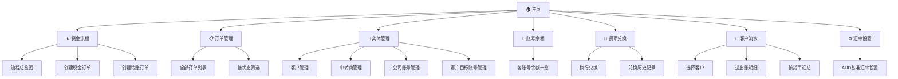
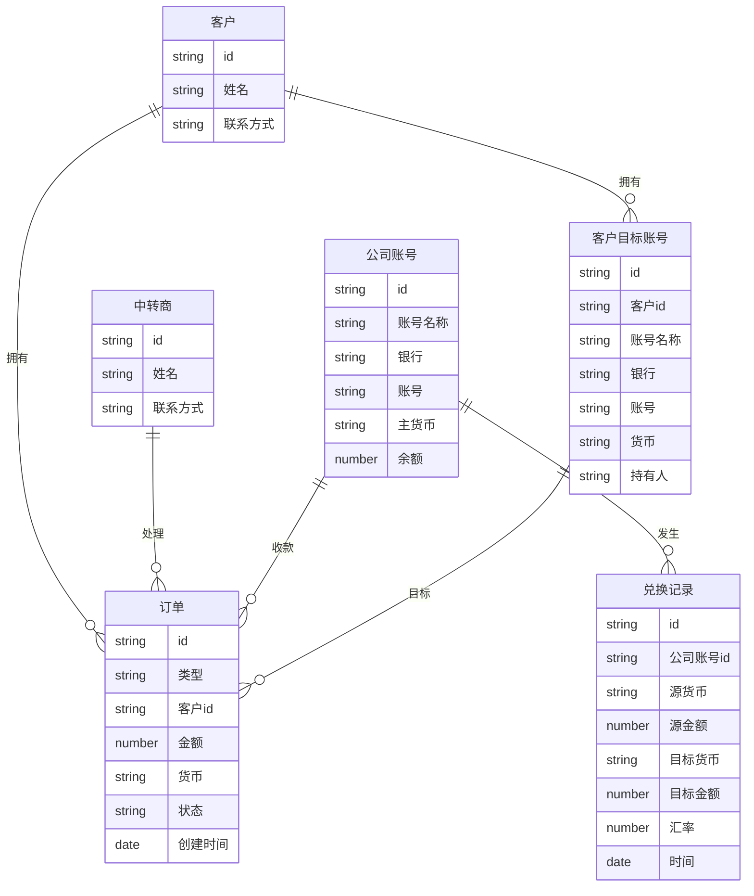

# 系统结构

---

## 一、页面模块结构



---

## 二、数据模型



---

## 三、技术架构

```
前端（纯静态）
├── index.html          # 应用入口，单页应用
├── CSS                 # 内联样式
└── JavaScript          # 内联脚本
    ├── 数据层           # LocalStorage 读写
    ├── 业务逻辑层       # 订单状态机、汇率计算
    └── 视图层           # DOM 渲染、事件绑定
```

| 层级 | 技术 | 说明 |
|------|------|------|
| 前端框架 | 原生 HTML/CSS/JS | 无依赖，轻量 |
| 数据持久化 | LocalStorage | 浏览器本地，无服务器 |
| 图表渲染 | 内置 DOM | 原生绘制 |
| 部署 | 静态托管 | minimaxi.com |

---

## 四、订单状态机

```mermaid
stateDiagram-v2
    note right of 待处理 : 仅现金订单有此状态
    note right of 在公司账号 : 转账订单从此开始

    [*] --> 待处理 : 新建现金订单
    [*] --> 在公司账号 : 新建转账订单
    待处理 --> 交中转商 : 交给中转商
    交中转商 --> 在公司账号 : 确认到账
    在公司账号 --> 已完成 : 完成转出
    已完成 --> [*]
```

---

## 相关文档

- [[软件说明]]
- [[使用指南]]
- [[资金流程图]]
- [[开发计划]]
