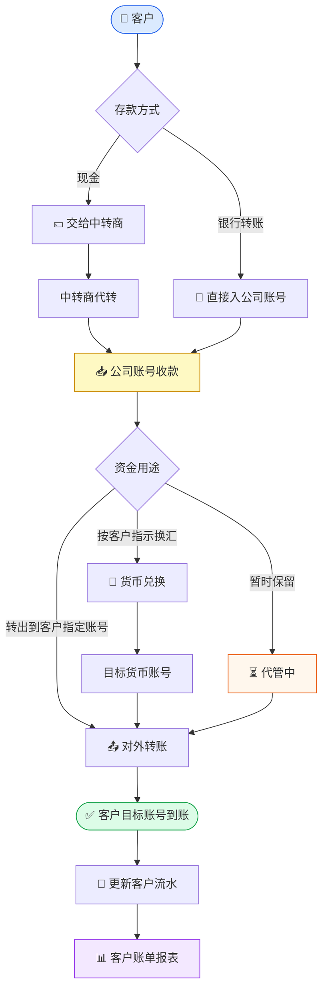
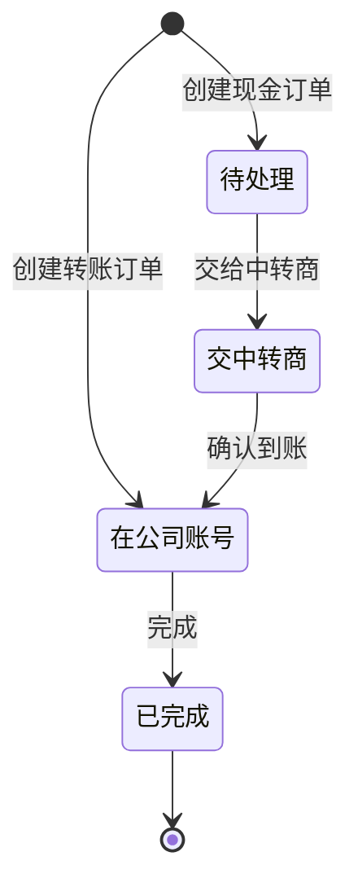

# 资金流程图

---

## 一、完整资金流转总览

---

## 二、现金订单流程

**适用场景**：客户交来现金 → 经中转商（如 Bob）转账入公司账号 → 再完成换汇转出

---

## 三、直接转账订单流程

**适用场景**：客户直接银行转账入公司账号，无需中转商

---

## 四、订单状态总览

---

## 五、货币兑换流程

---

## 相关文档

- [[软件说明]]
- [[使用指南]]
- [[系统结构]]
